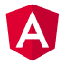

  

###

<h1 align="left">Hello World!! I am Tobias 👋</h1>

###

I’m a trained IT specialist with a background in system integration and over 10 years of experience as an IT system administrator. Along the way, I discovered my passion for software development. Since mid-2024, I’ve been diving deep into both frontend and backend development, continuously learning and building new projects. I enjoy tackling real-world problems, exploring modern technologies, and growing my skills step by step. Always excited to connect and collaborate!

###

👉 Check my projects here: <a href="https://tobias-klanert.de/" target="_blank">https://tobias-klanert.de/</a>

###

<h2 align="left">Tech Stack</h2>

###

<h3 align="left">Frontend</h3>

###

  
  
  
  
  
  
  
  
  
  
  

###

<h3 align="left">Backend</h3>

###

  
  
  
  
  
  
  

###

<h3 align="left">Dev-Tools</h3>

###

  
  
  
  
  
  
  
  
  

###

<h2 align="left">GitHub Stats</h2>

###

  
  

###

<h2 align="left">About me</h2>

###

💼 10+ years as an IT system administrator 💻 Currently shifting into software development 🔧 Passionate about problem-solving, clean architecture, and automation 🎯 Learning full-stack development since mid-2024 🤝 Open to collaboration and new challenges

###

<h2 align="left">What I'm Currently Working On</h2>

###

  <ul>
    <li>Building real-world full-stack applications</li>
    <li>Expanding my knowledge in Django/DRF and Angular</li>
    <li>Improving my testing and API design skills</li>
    <li>Exploring DevOps topics</li>
  </ul>

###

<h2 align="left">Fun Fact</h2>

###

I get strangely excited about tidy folder structures.

###

<h2 align="left">How to reach me</h2>

###

  
  

###

<h2 align="left">Snake!</h2>

###

###